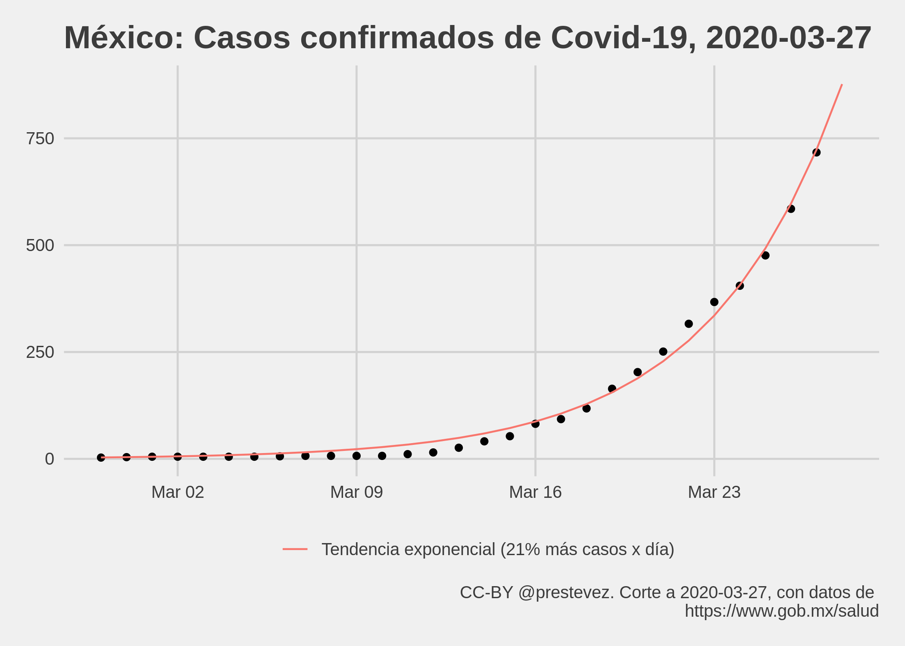

# Evolución de casos confirmados de Covid-19 en México


```r
library(tidyverse)
library(ggthemes)
library(lubridate)

casos <- read_csv("confirmados.csv")
```

```
## Parsed with column specification:
## cols(
##   date = col_date(format = ""),
##   casos = col_double()
## )
```

```r
casos$t <- (nrow(casos)-1):0

casos %>%
  filter(casos > 0) -> casos

m1 <- glm(casos ~ t, 
          data = casos,
          family = gaussian("log"))

max_date <- max(casos$date) + 1
max_t <- max(casos$t) + 1

tibble(
  date = seq(max_date,max_date+2, 1),
  casos = NA,
  t = max_t:(max_t+2),
  predicted = predict(m1, newdata = data.frame(t = max_t:(max_t+2)), type = "response")
  ) %>%
  bind_rows(
    mutate(casos,
      predicted = predict(m1, type = "response"))) %>%
  arrange(date) -> casos_with_predictions

modelo <- paste0("Predicción casos = exp(",
                 round(m1[[1]][1], 2),
                 " + ",
                 round(m1[[1]][2], 2),
                 " x día)")

hoy <- max_date - 1

pg <- "https://www.gob.mx/salud/documentos/informacion-internacional-y-nacional-sobre-nuevo-coronavirus-2019-ncov"

casos_with_predictions %>%
  ggplot(aes(date, casos)) + 
  geom_point() +
  theme_fivethirtyeight() +
  geom_line(aes(y = predicted, colour = modelo)) +
  xlab("Total de casos") + 
  labs(title = "México: Casos confirmados de Covid-19",
       caption = paste0("CC-BY @prestevez. Corte a ", hoy, ", con datos de \n", pg)) +
  theme(legend.title = element_blank()) -> p1

ggsave("casos.png", p1, width = 7, height = 5)
```

```
## Warning: Removed 3 rows containing missing values (geom_point).
```




Gráfica con evolución de casos confirmados de Covid-19 en México. Datos originales tomados de la página de la [Secretaría de Salud](https://www.gob.mx/salud/documentos/informacion-internacional-y-nacional-sobre-nuevo-coronavirus-2019-ncov). 

La gráfica muestra también una linea de tendencia calculada con un modelo no lineal:
$$
casos = e^{\beta0 + \beta \times día}
$$

Resultados del modelo:


```r
summary(m1)
```

```
## 
## Call:
## glm(formula = casos ~ t, family = gaussian("log"), data = casos)
## 
## Deviance Residuals: 
##     Min       1Q   Median       3Q      Max  
## -4.4346  -0.4497   3.1262   3.6021   4.4694  
## 
## Coefficients:
##             Estimate Std. Error t value Pr(>|t|)    
## (Intercept) -1.61580    0.65191  -2.479   0.0265 *  
## t            0.32735    0.04348   7.529 2.76e-06 ***
## ---
## Signif. codes:  0 '***' 0.001 '**' 0.01 '*' 0.05 '.' 0.1 ' ' 1
## 
## (Dispersion parameter for gaussian family taken to be 12.35506)
## 
##     Null deviance: 1504.94  on 15  degrees of freedom
## Residual deviance:  172.95  on 14  degrees of freedom
## AIC: 89.493
## 
## Number of Fisher Scoring iterations: 14
```

La gráfica presenta una extrapolación de la línea de tendencia indicando cuantos casos habría en tres días *asumiendo que la tendencia se mantiene*. Sin embargo, es importante notar que los datos tienen un gran sesgo de medición, pues representan solamente los casos detectados---los cuales variarán en función de la cantidad de pruebas realizadas y verificadas por la autoridad sanitaria. Por tanto, *es posible que el modelo predictivo contenga errores importantes y que los casos detectados sean menores (o mayores) a los esperados*.

Por tanto, considerando las limitaciones de los datos, los resultados del modelo no deben de considerarse como predicciones robustas. Son aproximaciones extremadamente simples para dar una idea genera de cómo podría evolucionar el fenómeno con base en los datos existentes.

# Caso italiano

Un ejercicio similar elaborados por expertos para el caso italiano puede encontrarse en Ramuzzi y Ramuzzi (2020).

Remuzzi, A. y Remuzzi, G. (2020) 'COVID-19 and Italy: what next?' *The Lancet* [online] doi: [10.1016/S0140-6736(20)30627-9](https://doi.org/10.1016/S0140-6736(20)30627-9)


