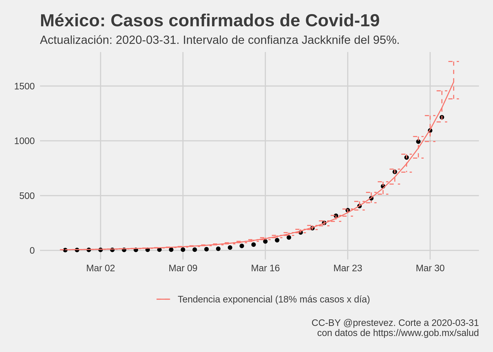

Evolución de Covid-19 en México
================
[Patricio R Estevez-Soto](https://twitter.com/prestevez).
Actualizado: 2020-03-25 08:48:22 GMT

# Crecimiento de casos confirmados de Covid-19 en México


Gráfica con evolución de casos confirmados de Covid-19 en México. Datos
originales tomados de la página de la [Secretaría de
Salud](https://www.gob.mx/salud/documentos/informacion-internacional-y-nacional-sobre-nuevo-coronavirus-2019-ncov).

La gráfica muestra también una linea de tendencia calculada con un
modelo exponencial:

*E\[casos | dia\] = e<sup>b<sub>0</sub> + b x dia</sup>*

La gráfica presenta una extrapolación de la línea de tendencia indicando
**cuantos casos habría en un día asumiendo que la tendencia se
mantiene**. Sin embargo, es importante notar que **los datos tienen un
gran sesgo de medición**, pues representan solamente los **casos
detectados**—los cuales variarán en función de la cantidad de pruebas
realizadas y verificadas por la autoridad sanitaria. Por tanto, **es muy
probable que el modelo predictivo contenga errores importantes y que los
casos detectados sean menores (o mayores) a los esperados**.

Considerando las limitaciones de los datos, los resultados del modelo
**no deben de considerarse como predicciones robustas**. Son
aproximaciones ingenuas para dar una idea general de cómo podría
evolucionar el fenómeno con base en los datos existentes.

Parámetros del modelo predictivo:

    ## 
    ## Call:
    ## glm(formula = casos ~ t, family = gaussian("log"), data = casos)
    ## 
    ## Deviance Residuals: 
    ##     Min       1Q   Median       3Q      Max  
    ## -35.681  -11.384   -3.147    1.598   28.067  
    ## 
    ## Coefficients:
    ##             Estimate Std. Error t value Pr(>|t|)    
    ## (Intercept) 0.555597   0.192480   2.887  0.00811 ** 
    ## t           0.212797   0.007945  26.785  < 2e-16 ***
    ## ---
    ## Signif. codes:  0 '***' 0.001 '**' 0.01 '*' 0.05 '.' 0.1 ' ' 1
    ## 
    ## (Dispersion parameter for gaussian family taken to be 191.941)
    ## 
    ##     Null deviance: 376847.0  on 25  degrees of freedom
    ## Residual deviance:   4606.5  on 24  degrees of freedom
    ## AIC: 214.39
    ## 
    ## Number of Fisher Scoring iterations: 6

# Estimación de errores Jackknife

Los errores estándar calculados en el modelo exponencial son erróneos.
Esto es porque, especialmente para los casos acumulados, pero para para
muchos datos en serie de tiempo los modelos no son independientes entre
sí (hay autocorrelación en el tiempo) y no están identicamente
distribuidos. Por ello, los errores no cumplen con los supestos básicos
del modelo y no son confiables.

Hay varias maneras de obtener errores robustos. Una de ella es usar el
método
[Jackknife](https://es.wikipedia.org/wiki/Jackknife_\(estad%C3%ADstica\)).
Esto implica calcular la línea de tendencia *n* veces omitiendo
secuencialmente una observación del índice 1 a *n* de cada cáclulo. Ello
nos da una distribución más robusta del valor esperado del estimador de
la tendencia.



Gráfica con evolución del total de casos confirmados de Covid-19 en
México con errores Jackknife.

El Jackknife no es la única forma de obtener errores robustos. En es
caso decidí usar el Jackknife para controlar el sesgo por errores de
muestreo y controlar el efecto de observaciones fuera de rango
(outliers). De nuevo, este no es un modelo epidemiológico y las
predicciones no son robustas.

Parámetros Jackknife del modelo predictivo de casos:

    ## # A tibble: 2 x 4
    ##   var         Estimate ci_low ci_high
    ##   <chr>          <dbl>  <dbl>   <dbl>
    ## 1 (Intercept)    0.545  0.356   0.604
    ## 2 t              0.213  0.211   0.222

# Modelo de casos nuevos

El modelo exponencial del acumulado de casos confirmados de Covid-19 es
problemático pues las observaciones son monotónicas (solo pueden
permanecer igual o crecer) y presentan una fuerte correlación temporal
(el total de hoy es el total de ayer más los casos de hoy). Por tanto,
se
[recomienda](https://www.thelancet.com/journals/lancet/article/PIIS0140-6736\(03\)13335-1/fulltext)
analizar el conteo de **casos nuevos** en lugar de usar el total de
casos confirmados.

Para ello utilicé un modelo Poisson (un modelo apropiado para modelar
conteos de eventos discretos) asumiendo que la tasa de ocurrencia de
casos nuevos varía exponencialmente con el tiempo (según el modelo
Poisson estándar). Asimismo, utilicé errores estándar Jackknife para
calcular un intervalo de confianza del 95%.


De nuevo, es importante recordar que este modelo no es robusto ni busca
modelar el curso de la epidemia, es simplemente una aproximación al
patrón de crecimiento que han seguido los casos reportados de Covid-19.

Parámetros del modelo predictivo de casos nuevos:

    ## 
    ## Call:
    ## glm(formula = casos_nuevos ~ t, family = poisson("log"), data = casos_ext)
    ## 
    ## Deviance Residuals: 
    ##     Min       1Q   Median       3Q      Max  
    ## -4.4629  -1.6575  -0.8045   0.9598   3.2725  
    ## 
    ## Coefficients:
    ##             Estimate Std. Error z value Pr(>|z|)    
    ## (Intercept) -0.81100    0.23475  -3.455 0.000551 ***
    ## t            0.19595    0.01065  18.398  < 2e-16 ***
    ## ---
    ## Signif. codes:  0 '***' 0.001 '**' 0.01 '*' 0.05 '.' 0.1 ' ' 1
    ## 
    ## (Dispersion parameter for poisson family taken to be 1)
    ## 
    ##     Null deviance: 637.12  on 25  degrees of freedom
    ## Residual deviance:  99.13  on 24  degrees of freedom
    ## AIC: 182.48
    ## 
    ## Number of Fisher Scoring iterations: 5

    ## # A tibble: 2 x 4
    ##   var         Estimate ci_low ci_high
    ##   <chr>          <dbl>  <dbl>   <dbl>
    ## 1 (Intercept)   -0.818 -1.09   -0.695
    ## 2 t              0.196  0.191   0.210

# Casos esperados mañana

Mañana se espera que el **total acumulado de casos confirmados** de
Covid-19 alcance **545**, con un intervalo de confianza Jackknife del
95% entre **423** y **732**, si la tendencia observada hasta hoy se
mantiene igual.

Según el modelo de casos nuevos, mañana se esperan **88 casos
confirmados nuevos**, con un intervalo de confianza Jackknife del 95%
entre **58** y **144**, si la tendencia observada hasta hoy se mantiene
igual.

Sin embargo, estas cifra muy probablemente estén equivocadas, pues el
modelo usado es extremadamente simple. El objetivo es tener una vaga
noción de la cifra esperada.

# Precisión predictiva

Los modelos se actualizan cada día conforme se publican los datos de
casos confirmados. En esta sección se presenta la diferencia entre el
número de casos observados hoy contra el número de casos que se
esperaban hoy según el modelo del día anterior.

Para el modelo del acumulado de casos:

| Fecha      | Casos Totales Observados | Predicción |   Error |
| :--------- | -----------------------: | ---------: | ------: |
| 2020-03-15 |                       53 |      51.89 |    1.11 |
| 2020-03-16 |                       82 |      73.72 |    8.28 |
| 2020-03-17 |                       93 |     115.68 | \-22.68 |
| 2020-03-18 |                      118 |     134.77 | \-16.77 |
| 2020-03-19 |                      164 |     163.96 |    0.04 |
| 2020-03-20 |                      203 |     218.34 | \-15.34 |
| 2020-03-21 |                      251 |     273.56 | \-22.56 |
| 2020-03-22 |                      316 |     335.79 | \-19.79 |
| 2020-03-24 |                      405 |     487.84 | \-82.84 |

Para el modelo de casos nuevos:

| Fecha      | Casos Nuevos Observados | Predicción |   Error |
| :--------- | ----------------------: | ---------: | ------: |
| 2020-03-22 |                      65 |      70.92 |  \-5.92 |
| 2020-03-23 |                      51 |      87.47 | \-36.47 |
| 2020-03-24 |                      38 |      91.69 | \-53.69 |

# Discusión

El uso de modelos exponenciales para predecir el número de casos
confirmados de Covid-19 es consistente con ejercicios [realizados en
otros países](https://doi.org/10.1016/S0140-6736\(20\)30627-9).

La tendencia exponencial del modelo sugiere que **el número de casos
confirmados se duplica cada 3.26 días**. Este ritmo es más rápido que
[el observado a nivel
global](https://ourworldindata.org/coronavirus#growth-of-cases-how-long-did-it-take-for-the-number-of-confirmed-cases-to-double),
pero es consistente con los ritmos de crecimiento observados durante las
primeras semanas de la epidemia en otros países.

Cabe recalcar que el ritmo de aumento en los casos confirmados **no es
equivalente al ritmo de crecimiento de casos totales** de Covid-19, pues
como se mencionó, los casos confirmados dependen tanto del incremento en
casos totales como de la cantidad de pruebas realizadas. Es probable que
conforme aumente la cantidad de pruebas realizadas, el ritmo de
crecimiento de los casos confirmados se haga más lento.

El modelo presentado no considera el efecto que puedan tener las medidas
de mitigación de la epidemia en la cantidad de casos confirmados en el
futuro. Como se ha mostrado en la
[evidencia](https://www.thelancet.com/journals/laninf/article/PIIS1473-3099\(20\)30144-4/fulltext)
[académica](https://www.thelancet.com/journals/langlo/article/PIIS2214-109X\(20\)30074-7/fulltext),
y se ilustra magistralmente en [el artículo de Harry Stevens en el
Washington
Post](https://www.washingtonpost.com/graphics/2020/world/corona-simulator-spanish/),
las medidas de contención y mitigación como aislamiento de pacientes,
cuarentenas a ciudades y regiones, y especialmente el distanciamiento
social, han demostrado ser efectivas para alentar el ritmo de
crecimiento de la epidemia.

**En la medida que dichas medidas se adopten con vigor en México, se
esperaría que el crecimiento de casos confirmados de Covid-19 en el país
sea más lento.**

# Aclaración

El modelo presentado es **un modelo estadístico básico** que no
considera supuestos epidemiológicos o médicos relevantes para predecir
con mayor precisión cómo evolucionará la epidemia de Covid-19 en el
país. La información es de carácter informativo solamente.

[Modelar epidemias de forma precisa es complejo y
difícil](https://twitter.com/danitte/status/1240330754460008448), aun
más en el caso de una enfermedad nueva como la Covid-19. Por tanto,
reitero que mi objetivo no es modelar cuál va a ser el comportamiento de
largo alcance de la epidemia.

Mi objetivo es mucho más modesto: solo se busca dar una idea general de
cuántos casos confirmados de Covid-19 podrían reportarse mañana según la
tendencia observada hasta el presente, reconociendo que dicha predicción
está sujeta a errores de medición y modelado.

# Reproducir

Para reproducir este análisis usando [R](https://cran.r-project.org/),
clona o descarga el repositorio y corre:

``` r
# requiere {rmarkdown}, {tidyverse} y {ggthemes}
rmarkdown::render("README.Rmd")
```

# Actualizaciones

  - **19-03-2020**: La extrapolación se redujo a 1 día dados los errores
    de predicción del modelo. Se expandió la sección de aclaración. Se
    corrigió el cálculo del tiempo en el que se espera que se dupliquen
    el total de casos confirmados. El cálculo anterior estaba sesgado
    hacia abajo (el tiempo calculado era menor, el cálculo anterior era
    2/exp(Beta) = t, debe ser log(2)/Beta = t).
  - **23-03-2020**: Se agregó un modelo Poisson de casos nuevos. Se
    agregaron Jackknife estimates.

# Licencia

<a rel="license" href="http://creativecommons.org/licenses/by/4.0/"></a><br />Esta
obra está bajo una
<a rel="license" href="http://creativecommons.org/licenses/by/4.0/">Licencia
Creative Commons Atribución 4.0 Internacional</a>.
